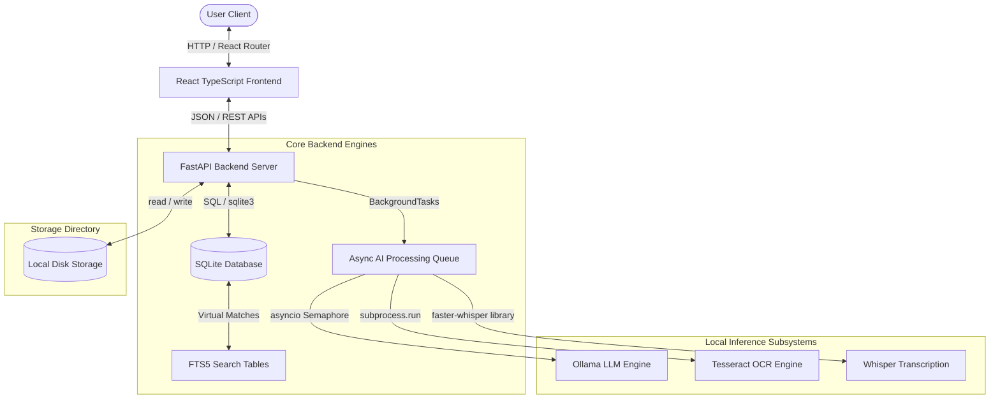
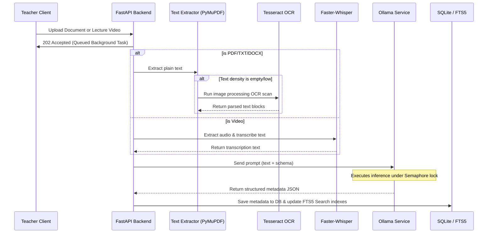
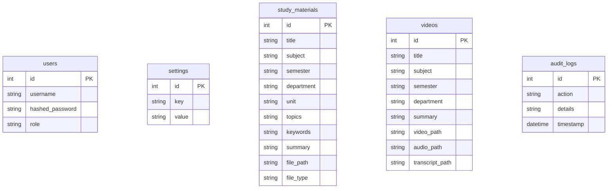

# CampusAI

[](https://github.com/)
[](LICENSE)
[]()
[]()
[]()

CampusAI is a production-ready, **offline-first academic management and ingestion platform** designed to run entirely local AI services without reliance on cloud APIs. Built with a CPU-First architecture, CampusAI runs local LLMs (Ollama), audio transcriptions (Faster-Whisper), OCR engines (Tesseract), and full-text search (SQLite FTS5) directly on standard server and client workstations.

---

## What is CampusAI?

CampusAI exists to address the accessibility gap in academic setups with limited, unreliable, or non-existent internet access. In standard environments, AI enrichment pipelines rely on costly, bandwidth-heavy remote APIs. CampusAI shifts the entire paradigm to **local edge computing**, processing documents, lectures, and profiles entirely on local CPU and memory resources.

### Objectives:
* **Bandwidth Independence:** Zero network packets leave the system during document ingestion or AI processing.
* **100% Data Sovereignty:** Highly confidential student registers, logs, and lecture videos are preserved on site.
* **Low Latency Local Search:** Sub-second multi-category searches using BM25 ranking.
* **Automated Data Structured Entry:** Converts raw, unstructured notes and scans into clean databases automatically.

---

## Features

### Authentication
* **Role-Based Access Control:** Distinct profiles for **Teachers (Admin)** and **Students**.
* **JWT Access Control:** Secure stateless session tokens stored inside the request headers.
* **Password Hashing:** Industry-standard password hashing using `bcrypt`.
* **Password Management:** Secure on-the-fly password updates for registered users.

### AI Processing
* **Ollama Integration:** Queries local LLMs (default: `deepseek-r1:1.5b`) for abstractive summaries, keywords, and metadata.
* **AI Ingestion Semaphore:** Restricts concurrent AI operations to a single worker queue to prevent CPU starvation and HTTP timeout cascades.
* **Academic Metadata Extraction:** Automatically extracts Department, Subject, Semester, and syllabus Units.
* **AI-generated Titles:** Converts raw, non-descriptive filenames (e.g. `doc_123.pdf`) into reader-friendly academic titles.

### OCR (Optical Character Recognition)
* **PyMuPDF Document Parser:** High-efficiency text extraction from digital PDF documents.
* **Tesseract OCR Fallback:** Scans low-density or scanned PDFs, converting image blocks to plain text.
* **Student Register OCR:** Runs OCR scans on scanned student enrollment papers to pre-fill name, roll number, and department fields.

### Lecture Video Processing
* **Faster-Whisper Subsystem:** Decodes MP4/MKV video tracks locally, extracting audio and transcribing spoken content.
* **Automatic Summary Ingestion:** Transcripts are automatically analyzed by local LLMs to populate summary, topics, and keywords.

### Search Engine
* **SQLite FTS5:** Leverages virtual text-search tables (`fts_materials` and `fts_videos`) with prefix wildcard matching.
* **Relevance Ranking:** Orders results using the BM25 query relevance algorithm.

### Configuration Dashboard
* **Dynamic AI Setting Updates:** Dynamically edit AI Model name, Whisper size, OCR toggles, temperature, timeouts, and retry limits.

---

## Screenshots

*Note: Visual placeholders represent the corresponding routes in the React Frontend client.*

* **Login Panel (`/auth/login`):** Secure login interface for teachers and students.
* **Teacher Dashboard (`/admin/dashboard`):** High-level view showing active statistics, student counts, and content panels.
* **Dynamic Settings (`/settings`):** Global settings interface for tweaking inference devices, model tags, and passwords.
* **Upload Notes (`/admin/notes/upload`):** Ingestion manager for uploading documents (PDF, DOCX, TXT, PPTX).
* **Upload Lectures (`/admin/videos/upload`):** Video upload interface with progress bar and background processing status.
* **Search Engine (`/search`):** Unified multi-category search with relevance-sorted result filters.
* **Student Dashboard (`/student/dashboard`):** Student portal for searching, downloading, and reviewing summaries.

---

## Architecture



### Layer Explanation
1. **User Client / React Frontend:** Single-page TypeScript application running in client web browsers, managing localization and state.
2. **FastAPI Backend:** Handles routing, JWT extraction, file validation, database query compilation, and async worker dispatching.
3. **SQLite & FTS5:** Manages structured tables and replicates text metadata inside virtual FTS tables for sub-second text matching.
4. **Local Inference Subsystems:** Process audio/video (Whisper), image-text extraction (Tesseract), and abstractive metadata structured analysis (Ollama) locally.

---

## Folder Structure

```
CampusAI/
├── backend/
│   ├── app/
│   │   ├── api/             # API Routers (auth, materials, search, settings, students, syllabus, videos)
│   │   ├── auth/            # JWT validation, password hashing security mechanisms
│   │   ├── core/            # Settings config loading envs
│   │   ├── database/        # SQLite connection setup, db_models initialization
│   │   ├── models/          # SQLAlchemy Database Models (User, Setting, Video, StudyMaterial, etc.)
│   │   ├── schemas/         # Pydantic schemas validation
│   │   └── services/        # Subservices (OCR, Search, LLM, Whisper processors)
│   └── storage/             # local media directories (materials, videos, transcripts, thumbnails)
├── frontend/
│   ├── src/
│   │   ├── components/      # Shared components (LanguageSelector, Sidebar, ProtectedRoute)
│   │   ├── context/         # AuthContext state hooks
│   │   ├── pages/           # Pages (Dashboard, Settings, Login, admin/UploadNotes, student/Dashboard)
│   │   └── i18n.ts          # Localization resource bundles (English, Hindi, Telugu)
│   └── package.json
└── tests/                   # End-to-end integration and API unit test suites
```

---

## Tech Stack

| Component | Technical Details |
| :--- | :--- |
| **Frontend** | React 18, TypeScript, TailwindCSS, Vite |
| **Backend** | FastAPI, Python 3.13, Uvicorn, SQLAlchemy |
| **Database** | SQLite3 with Full-Text Search (FTS5) extension |
| **OCR** | PyMuPDF (fitz), Tesseract OCR Engine |
| **AI LLM** | Ollama (DeepSeek-R1 1.5B, Qwen2.5) |
| **Speech-to-Text** | Faster-Whisper (ctranslate2 framework) |
| **Authentication** | JSON Web Tokens (JWT), passlib (bcrypt) |
| **CI/CD** | GitLab CI, pre-commit, Ruff formatting |

---

## Installation

### Prerequisites

#### Windows / Host Setup
1. Install **Node.js 18+** from [Node.js Official Website](https://nodejs.org/).
2. Install **Python 3.10+** from [Python Official Website](https://www.python.org/).
3. Install **Tesseract OCR** (For Windows, download binary installer and add install path `C:\Program Files\Tesseract-OCR` to System environment variables).
4. Download and install **FFmpeg** (Ensure `ffmpeg` and `ffprobe` binaries are available in System environment variables).

#### WSL / Linux Setup (Recommended)
1. Update packages and install prerequisites:
   ```bash
   sudo apt-get update
   sudo apt-get install -y python3-pip python3-venv ffmpeg tesseract-ocr
   ```

### Setup Pipeline

1. **Clone the repository:**
   ```bash
   git clone https://code.swecha.org/kommera/smart-attendance-management-system.git campusai
   cd campusai
   ```

2. **Initialize Python Virtual Environment:**
   ```bash
   python3 -m venv .venv
   # Windows PowerShell:
   .venv\Scripts\Activate.ps1
   # WSL / Linux:
   source .venv/bin/activate
   ```

3. **Install Dependencies:**
   ```bash
   pip install -r requirements.txt
   ```

4. **Install Frontend Dependencies:**
   ```bash
   cd frontend
   npm install
   cd ..
   ```

5. **Start Ollama Engine:**
   * Download and install Ollama from [Ollama.ai](https://ollama.com).
   * Pull the target model in your terminal:
     ```bash
     ollama pull deepseek-r1:1.5b
     ```

---

## Configuration

CampusAI loads default settings on initialization. System settings can be customized dynamically using the Settings dashboard.

| Key | Default | Description |
| :--- | :--- | :--- |
| `ollama_model` | `deepseek-r1:1.5b` | Ollama model identifier used for extraction task. |
| `whisper_model` | `tiny` | Transcription model weight profile (`tiny`/`base`/`small`). |
| `ocr_enabled` | `true` | Enables/Disables Tesseract scanning fallback on digital documents. |
| `temperature` | `0.1` | Temperature level for LLM response generation (low values enhance json stability). |
| `timeout` | `300` | Maximum request duration in seconds allowed for Ollama inferences. |
| `retry_count` | `3` | Attempts to retry LLM execution upon failure or invalid JSON formatting. |
| `max_upload_size` | `104857600` (100MB) | File size threshold limits in bytes for video uploads. |

---

## Running the Application

### 1. Run the Backend API Server
Make sure you are in the project root and virtual environment is active:
```bash
# Windows
$env:PYTHONPATH="backend"
.venv\Scripts\python.exe -m uvicorn app.main:app --host 127.0.0.1 --port 8000

# WSL / Linux
export PYTHONPATH=backend
.venv/bin/uvicorn app.main:app --host 127.0.0.1 --port 8000
```

### 2. Run the Frontend Client
Open a second terminal window:
```bash
cd frontend
npm run dev
```
Navigate to `http://localhost:5173` in your web browser.

---

## How to Use

### Admin (Teacher) Workflow
1. **Login:** Log in using `admin` / `admin123` (or register a Teacher credentials).
2. **Settings Configuration:** Tweak active models, parameters, or modify passwords at `/settings`.
3. **Upload Notes:** Upload slide decks, textbook extracts, or scanned documents. Wait for processing to complete.
4. **Upload Lecture Videos:** Drag-and-drop video classes. FFmpeg and Whisper process audio in the background.
5. **Register Students:** Use the Register Student panel; upload scanned admission letters to extract profile keys automatically.

### Student Workflow
1. **Login:** Access student dashboard using student credentials.
2. **Unified Search:** Query topics (e.g. "Coffman conditions", "Process scheduling").
3. **Review Summary & Downloads:** View summaries, topics, and click Download to access original files.

---

## AI Ingestion Pipeline



---

## API Documentation

| Method | Endpoint | Authentication | Description | Request Payload | Response Examples |
| :--- | :--- | :--- | :--- | :--- | :--- |
| **POST** | `/auth/login` | None | Authenticate user credentials. | `{"username": "admin", "password": "..."}` | `{"access_token": "...", "role": "admin"}` |
| **POST** | `/materials/upload` | Teacher JWT | Ingest study notes. | Multipart Form: `file` | `{"id": 1, "title": "...", "status": "processing"}` |
| **GET** | `/materials/{id}` | User JWT | Retrieve material metadata. | Path Parameter | `{"id": 1, "title": "...", "summary": "..."}` |
| **GET** | `/search` | User JWT | BM25 sorted keyword search. | Query string: `?q=searchterm` | `{"results": {"materials": [...], "videos": [...]}}` |
| **POST** | `/students` | Teacher JWT | Register student profile. | `{"name": "Name", "roll_number": "...", ...}` | `{"id": 1, "name": "...", "roll_number": "..."}` |
| **POST** | `/students/ocr` | Teacher JWT | Run OCR on admission file. | Multipart Form: `file` | `{"name": "...", "department": "..."}` |
| **GET** | `/settings` | User JWT | Load system configurations. | None | `{"timeout": "300", "ocr_enabled": "true"}` |

---

## Database Schema



---

## Supported File Formats

* **Documents:** `PDF` (digital and scanned), `DOCX`, `TXT`, `PPTX`
* **Images:** `PNG`, `JPEG`
* **Video/Audio:** `MP4`, `MKV`, `AVI`, `MP3`

---

## Security Specifications

1. **Stateful Cryptography:** JWT tokens sign payloads using an encrypted environment secret key configuration.
2. **Password Entropy:** Passwords hashed locally utilizing strong standard **bcrypt** salt rounds.
3. **Database Parameter Injection Prevention:** DB queries compile via SQLAlchemy Query Expressions, preventing SQL injection issues.
4. **Path Traversal Shield:** Ingested upload filenames generate unique UUID stems to isolate path traversal attacks.

---

## CI/CD Pipeline

The GitLab runner executes compliance workflows defined in `.gitlab-ci.yml`:
* **Linting & Formatting:** Checks structure conformity via `ruff check` and `ruff format`.
* **Testing:** Runs server unit checks via `pytest`.
* **Type Checking:** Ensures JavaScript/TypeScript files compile error-free via Vite compiler processes.

---

## Troubleshooting

### 1. ReadTimeout: httpx.ReadTimeout on Ollama requests
* **Cause:** Ollama CPU execution took longer than active timeout limits.
* **Fix:** Go to settings panel and increase `timeout` value to `300` or `500` seconds. Check CPU core loads.

### 2. Tesseract OCR executable not found
* **Cause:** Tesseract binary package is missing or not visible on execution PATH.
* **Fix (WSL / Linux):** Run `sudo apt-get install tesseract-ocr`.
* **Fix (Windows):** Add path `C:\Program Files\Tesseract-OCR` to user Path variables.

### 3. SQLite OperationalError: database is locked
* **Cause:** Database write concurrency clashes under multi-threaded processing.
* **Fix:** CampusAI enables SQLite WAL mode automatically. Ensure uvicorn calls close session threads on requests properly.

---

## Future Scope

* **Vector DB / RAG Pipeline:** Integration of ChromaDB locally to allow interactive chat-with-document capability.
* **Optimized GGUF Quantization:** Native support for DeepSeek-R1 8B models on edge laptops using hardware GPU acceleration drivers (CUDA/ROCm/Metal).

---

## License

This project is licensed under the GPL-3.0 License. See the [LICENSE](LICENSE) file for details.

---

## Acknowledgements

Special thanks to the open-source creators of Ollama, ctranslate2 (faster-whisper), Tesseract, and PyMuPDF for providing powerful offline capabilities.
